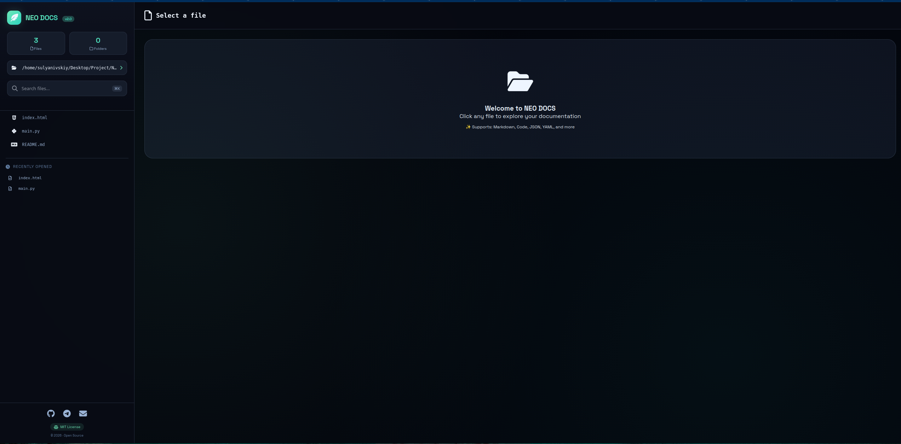
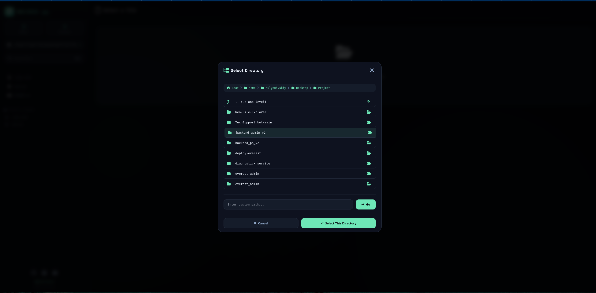
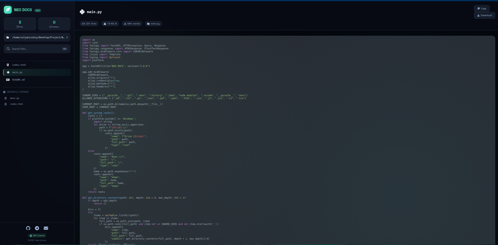
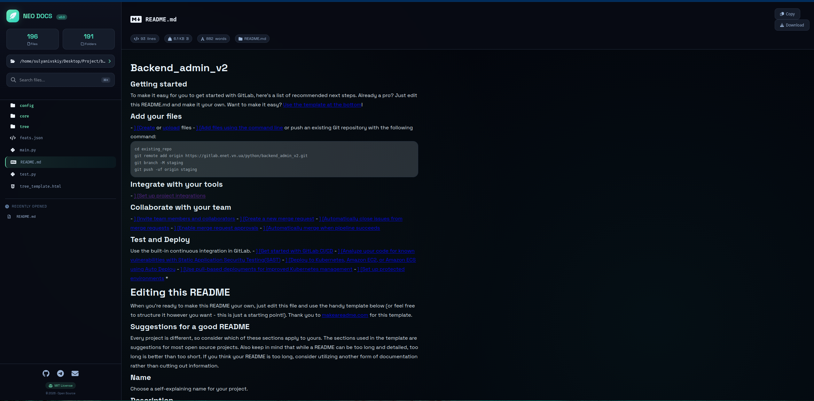

<!-- Avatar placeholder -->

# 🌟 NEO FS

### *Modern File System Explorer with Syntax Highlighting*

*A sleek, modern file system explorer with full filesystem navigation, syntax highlighting, and real-time file preview.*

---

## 📖 About

**NEO FS** is a powerful file system explorer that allows you to browse and view any file on your computer with style. Built with FastAPI backend and a modern glass-morphism UI, it provides seamless navigation through your entire filesystem with beautiful syntax highlighting and file preview.

> ⚠️ **Note**: This is a **file system explorer**, not just a documentation viewer. It can browse any directory on your computer!

### ✨ Key Features

- 🚀 **Full Filesystem Navigation** - Browse any directory on your system
- 📝 **File Preview** - View text files, code, markdown, JSON, YAML and more
- 🎨 **Modern UI** - Glass-morphism design with neon cyan-green accents
- 🔍 **Smart Search** - Filter files and folders in real-time
- 📁 **Directory Selector** - Modal-based filesystem explorer with breadcrumbs
- 💾 **File Operations** - Copy content, download files, copy file paths
- 📌 **Recent Files** - Quick access to recently viewed files (localStorage)
- 🖼️ **Syntax Highlighting** - Support for 15+ programming languages
- 🌐 **Cross-platform** - Works on Windows, Linux, and macOS
- 🚫 **No Cache** - Always shows the latest file content

---

## 🖼️ Screenshots

### Main Interface

  
   
  <em>Main application interface with file tree and preview panel</em>

### Directory Selector Modal

  
   
  <em>Modal window for browsing any directory on your system</em>

### Python File Preview

  
   
  <em>Python code with syntax highlighting and file statistics</em>

### Markdown File Preview

  
   
  <em>Markdown rendering with styled headings and code blocks</em>

---

